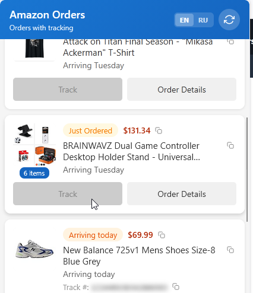

# Amazon Order Tracker

Браузерное расширение для отслеживания заказов Amazon с трек-номерами и статусами доставки.

## Возможности

- Просмотр активных заказов Amazon с информацией об отслеживании для удобства добавления в дроп-шиппинговые сервисы
- Статус доставки в реальном времени (Доставлен, В пути, Прибудет сегодня и др.)
- Копирование трек-номера, цены и названия товара одним кликом
- Быстрый переход на страницу отслеживания и детали заказа
- Двуязычный интерфейс: English / Русский

## Установка

Расширение работает в Chrome и Firefox. По умолчанию настроено для Chrome.

### Chrome
1. Откройте `chrome://extensions/`
2. Включите "Режим разработчика"
3. Нажмите "Загрузить распакованное"
4. Выберите папку расширения

### Firefox
1. Переименуйте `manifest-firefox.json` в `manifest.json`
2. Откройте `about:debugging`
3. Нажмите "This Firefox" > "Загрузить временное дополнение"
4. Выберите файл `manifest.json`

## Использование

1. Откройте страницу заказов Amazon (amazon.com/your-orders)
2. Нажмите на иконку расширения в панели браузера
3. Просматривайте заказы с трек-номерами
4. Кнопка **Track** — открыть страницу отслеживания
5. Кнопка **Order Details** — перейти к деталям заказа
6. Иконки копирования — скопировать цену, название или трек-номер